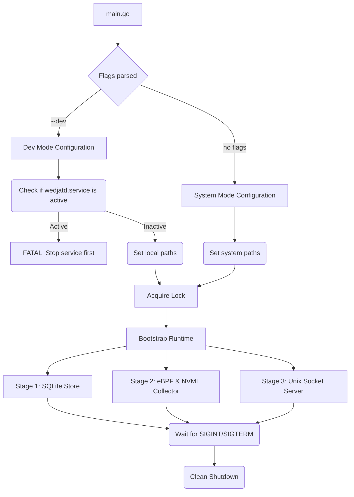

# wedjatd main.go Architecture

This outlines the structure, startup sequence, and developer guardrails for `daemon/cmd/wedjatd/main.go`.

## 1. High-Level Structure

## 2. Path Isolation (`--dev` vs System)

| Resource | System Mode | `--dev` Mode |
| :--- | :--- | :--- |
| **Config File** | `/etc/wedjat/config.yaml` | `./dev-config.yaml` |
| **Database Dir** | `/var/lib/wedjat` | `./dev-data` |
| **Lock File** | `/run/wedjat/daemon.lock` | `/tmp/wedjat-dev.lock` |
| **BPF Map Pin Path** | `/sys/fs/bpf/wedjat` | *(unpinned, kernel cleans up)* |

## 3. Startup Order

The daemon uses the existing `bootstrap.Start` logic to bring up stages in a safe, rollback-capable order:

1. **Flag Parsing & Dev Collision Guard**
   - Parse `--dev` and `--config`.
   - If `--dev` is set, invoke `systemctl is-active wedjatd.service`. If it returns success, **abort immediately** to prevent double-attaching eBPF probes.
   - Set up paths according to the mode.

2. **Locking**
   - Acquire the file lock (e.g., `/run/wedjat/daemon.lock` or `/tmp/wedjat-dev.lock`). This prevents two instances of the same mode from running.

3. **Stage 1: Store (`store.Open`)**
   - Opens the SQLite databases (metadata and daily).
   - Handles `reset_on_boot` logic and boot ID checks.
   - Writes the new heartbeat and clean shutdown state.

4. **Stage 2: Collector (`collector.Start`)**
   - This wraps the cgo bridge.
   - **NVML**: Initializes `nvmlInit()`.
   - **eBPF**: Loads the BPF skeletons (`driver_kprobes`, `cuda_actions`).
   - Attaches uprobes and kprobes.
   - Starts the background Go goroutine to poll the BPF perf buffers and NVML, and writes events to the `store`.

5. **Stage 3: Socket Server (`sock.Start`)**
   - Listens on `/run/wedjat/wedjat.sock` as the server; the CLI connects as a client.
   - Fans out the collector's in-progress accumulator — the only data that exists nowhere else, since it is destroyed at each flush.
   - Read-only toward clients. A client that connects, reads, and disconnects affects nothing on disk; a client that never connects also affects nothing.
   - Shutdown removes the socket file and closes all client connections.

6. **Running State**
   - The main goroutine blocks on `os.Signal` (SIGTERM, SIGINT).

## 4. Shutdown Sequence (Reverse Order)

When `SIGINT` (Ctrl+C) or `SIGTERM` (systemd stop) is caught:

1. **Stage 3 Shutdown (Socket Server)**
   - Close all client connections.
   - Remove the socket file from the filesystem.

2. **Stage 2 Shutdown (Collector)**
   - Stop the polling goroutine (a final flush writes the in-progress minute).
   - Destroy BPF skeletons. Because eBPF programs are unpinned (in dev mode) or we explicitly tear them down via libbpf, they detach cleanly from the kernel.
   - Call `nvmlShutdown()`.

3. **Stage 1 Shutdown (Store)**
   - Checkpoint the SQLite WAL.
   - Write `clean_shutdown = 1`.
   - Close the database connections cleanly.

4. **Lock Release**
   - The lock file is released and closed.

---

## 5. Stage Summary

| # | Stage | Writes | Purpose |
| :--- | :--- | :--- | :--- |
| 1 | `store` | SQLite | Durable history, both consumers' shared record |
| 2 | `collector` | SQLite | NVML + eBPF sampling, aggregation, flush |
| 3 | socket server | socket | Live in-progress minute for connected CLIs |

All three stages are registered in `daemon/cmd/wedjatd/main.go`. The socket
stage reads the collector's in-memory sample through `collector.Handle.Live()`;
see `daemon/socket/README.md` for the protocol and limits.

Only the store stage and the collector's flush touch disk. The socket server is
read-only toward its clients, and the daemon writes history whether or not any
client is connected. See [Data Flow](data_flow.md) for the full contract.
