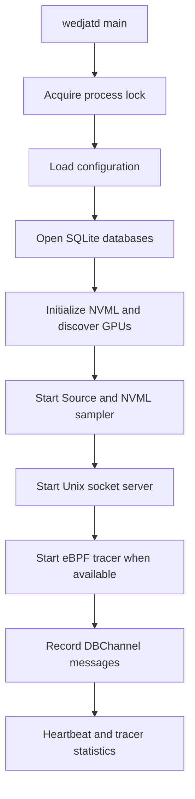

# Wedjat Daemon — Architecture

This document covers the full architecture of `wedjatd`: what it monitors, how
telemetry travels from the hardware to persistent storage, and how its internal
components are structured.

---

## 1. There Is No "Pure GPU Process"

On Linux, **every process is a CPU process**. A GPU is an accelerator connected
over PCIe; it cannot run OS processes on its own. Every machine has exactly two
kinds of CPU processes:

```
                       ┌──────────────────────────────────────────┐
                       │           Linux CPU Processes            │
                       └────────────────────┬─────────────────────┘
                                            │
               ┌────────────────────────────┴──────────────────────────┐
               ▼                                                       ▼
   TYPE A: Pure CPU Processes                            TYPE B: GPU-Accelerated Processes
   (bash, nginx, sshd, htop)                             (python3, vllm, llama-server, C++ CUDA)
   • Runs 100% on CPU cores                              • CPU host thread executes logic
   • Never touches libcuda.so                            • Calls libcuda.so to launch kernels
   • eBPF CUDA probes IGNORE these                       • eBPF CUDA probes INTERCEPT these
```

**Type A** (`bash`, `nginx`, `sshd`) never open a GPU device node or call any
CUDA function. The eBPF probes ignore them entirely.

**Type B** (`python3`, `vLLM`, `llama-server`) are standard CPU executables that
load CUDA code. The CPU host thread acts as a dispatcher — it allocates GPU
memory, copies tensors over PCIe, and submits kernels (math instructions) to the
GPU. The eBPF probes intercept every one of these calls at the exact microsecond
the CPU thread issues it.

---

## 2. The Five Telemetry Layers

### Layer 1 — Host Process & Kernel Context (eBPF Built-ins)

Every eBPF probe fires inside the kernel. The kernel provides this metadata for
free at every probe site:

- **`pid` / `tid`** — the process ID and thread ID making the GPU request
- **`comm`** — the 16-character executable name (`python3`, `llama.cpp`)
- **`cgroup_id`** — 64-bit identifier mapping the process to a Kubernetes pod or Docker container
- **`smp_processor_id`** — the host CPU core executing the thread
- **`timestamp_ns`** — boot-relative nanosecond timestamp used to align CPU and GPU events

### Layer 2 — User-Space CUDA Intent (Uprobes on `libcuda.so`)

Captures what the application *asks* the GPU to do, before the command reaches
the driver:

- **Kernel launches (`cuLaunchKernel`)** — kernel function address, block
  dimensions (`blockDim.{x,y,z}`), grid dimensions (`gridDim.{x,y,z}`),
  shared-memory size, and CUDA stream ID
- **Memory allocations (`cuMemAlloc` / `cudaMalloc`)** — requested VRAM size in
  bytes (entry probe) and the returned device pointer (exit `uretprobe`)
- **Data transfers (`cuMemcpy` / `cuMemcpyAsync`)** — transfer size in bytes and
  direction (host-to-device or device-to-host)
- **CPU stalls (`cuStreamSynchronize`)** — exact microsecond duration a CPU
  thread blocked waiting on the GPU's command queue, measured between entry and
  exit probes

### Layer 3 — OS & Driver Execution (Kprobes & Tracepoints)

Watches the proprietary NVIDIA driver (`nvidia.ko` and `nvidia-uvm.ko`) manage
the hardware:

- **IOCTL commands (`nvidia_unlocked_ioctl`)** — raw driver commands from user
  space to the GPU, including the specific command code
- **Memory mapping (`nvidia_mmap`)** — offsets and sizes when a process maps GPU
  memory into its address space
- **Interrupt latency (`nvidia_isr` & `nvidia_isr_kthread_bh`)** — microsecond
  latency between a hardware interrupt firing and the kernel thread that handles it
- **Driver errors (`nvidia_dev_xid`)** — critical hardware/driver faults (Xid
  error codes) at the moment they occur
- **CPU interference (`sched_switch` & `NET_RX`)** — scheduler and network
  softirq tracepoints that expose whether the GPU feed is stalling because a host
  thread was preempted by network traffic or disk I/O

### Layer 4 — Hardware Physical State (NVML Polling)

Because eBPF runs in the kernel, a sidecar poller queries NVML (NVIDIA
Management Library) for the physical state of the silicon:

- **Per-process accounting** — percentage of time a PID kept the GPU computing,
  and its peak VRAM usage in bytes
- **Global health** — real-time power draw (W), temperature (°C), SM clock
  speeds, memory-bandwidth utilization, and active PCIe transfer rates
- **Distributed networking (NCCL)** — for multi-GPU setups, tracking NCCL APIs
  reveals synchronization barriers and straggler nodes during `AllReduce` /
  `AllGather`

### Layer 5 — Device-Resident Micro-Telemetry (eGPU / bpftime)

Only available with dynamic PTX injection — compiling eBPF bytecode to run
*inside* the GPU's Streaming Multiprocessors:

- **Hardware placement (`%smid` & `%ctaid`)** — exactly which SM (0–131) and
  which CTA executed the code; enables an SM load-distribution heatmap
- **Warp divergence** — detects when threads within a 32-thread warp take
  different branch paths, forcing serialized execution
- **Memory coalescing (`LDG` / `STG`)** — hooks global load/store instructions
  to capture exact memory addresses and access sizes, catching uncoalesced reads
- **Instruction stalls** — nanosecond-granularity telemetry on *why* a warp is
  paused (shared memory, register dependency, or instruction fetch)

---

## 3. Full System Architecture

```text
┌─────────────────────────────────────────────────────────────────────────────┐
│                           config.yaml (defaults)                            │
│  ebpf_drain_tick_ms: 1000  nvml_db_tick_ms: 2000  nvml_socket_tick_ms: 500 │
└──────────────────────────────┬──────────────────────────────────────────────┘
                               ▼
┌─────────────────────────────────────────────────────────────────────────────┐
│                              daemon.Run()                                   │
│  Opens DB, discovers GPUs, starts Source, socket server, and eBPF tracer    │
└──────────────────────────────┬──────────────────────────────────────────────┘
                               │
          ┌────────────────────┴─────────────────────┐
          │                                          │
          ▼                                          ▼
┌───────────────────────────┐            ┌────────────────────────────┐
│ eBPF tracer               │            │ NVML sampler               │
│                           │            │                            │
│ ring buffer: continuous   │            │ PollGPU + PollProcesses    │
│ aggregate maps: timed     │            │ idle: nvml_db_tick_ms      │
│ drain (for example 1000ms)│            │ active: faster NVML tick  │
└─────────────┬─────────────┘            └──────────────┬─────────────┘
              │ TelemetryMessage                        │ NVML Sample
              └────────────────────┬────────────────────┘
                                   ▼
                      ┌───────────────────────────┐
                      │ source.Source dispatcher │
                      │ merges producer channels │
                      └─────────────┬─────────────┘
                                    │
                  ┌─────────────────┴──────────────────┐
                  │                                    │
                  │ eBPF all; NVML at DB tick         │ All types while client(s)
                  ▼                                    │ are connected
          ┌──────────────────┐                         ▼
          │ DBChannel        │                ┌────────────────────┐
          │ NVML + eBPF      │                │ SocketChannel      │
          └────────┬─────────┘                │ NVML + eBPF        │
                   │                          └─────────┬──────────┘
                   ▼                                    ▼
          ┌──────────────────┐                ┌────────────────────┐
          │ core.Record()    │                │ Socket broadcaster │
          │ dispatch by type │                │ JSON to each client│
          └────────┬─────────┘                └────────────────────┘
                   │
                   ▼
          ┌──────────────────┐
          │ SQLite           │
          │ NVML: gpu_minute,│
          │       process_vram
          │ eBPF: aggregate, │
          │       incident   │
          └──────────────────┘

eBPF process identity and lifecycle operations also use DB methods directly;
eBPF aggregates and incidents use the unified DBChannel path shown above.
```

The daemon is the database writer. The socket carries NVML samples, eBPF
aggregates, and eBPF incidents while clients are connected. NVML DB and socket
outputs each keep their configured cadence.

**Three architectural properties this diagram encodes:**

1. **Separate producers** — NVML polling and eBPF tracing have independent
   lifecycles and feed the source dispatcher.
2. **Type-based DB routing** — `core.Record` sends NVML samples, aggregates,
   and incidents to their corresponding database write paths.
3. **Socket filtering and rates** — NVML and eBPF messages enter `SocketChannel`
   only while clients are connected. The client count controls NVML poll
   frequency; the dispatcher keeps DB NVML output at `nvml_db_tick_ms` and
   socket NVML output at `nvml_socket_tick_ms`.

---

## 4. The Telemetry Pipeline

```
NVML ────────────┐
                 ├──→ Source dispatcher ──→ DBChannel ──→ core.Record ──→ SQLite
eBPF aggregates ─┤                              │
eBPF incidents ──┘                              └── All types, if clients
                                                       └──→ SocketChannel ──→ JSON clients
```

Two consumers, one writer.

- **SQLite** receives NVML samples and eBPF aggregate/incident messages through
  the daemon's DB channel and writer.
- **The Unix socket** broadcasts NVML samples and eBPF aggregates/incidents
  while clients are connected.

| Question | Source |
| :--- | :--- |
| "What did my job do at 03:00 last night?" | SQLite |
| "What is the GPU doing right now?" | Unix socket |
| "Did that CUDA operation get counted?" | SQLite, via aggregate telemetry |

### The store is a faithful sink

The source channels use bounded, non-blocking sends. A full channel can drop a
message so a slow consumer does not block its producer.

---

## 5. Internal Components



| Package | Responsibility |
| :--- | :--- |
| `core/db` | Metadata and daily SQLite databases; process and GPU identity; aggregation; incidents; retention |
| `core/source/nvml` | CGO bridge to NVML and adaptive GPU/process sampler |
| `core/source/ebpf` | BPF object loading and attachment; event consumption; counter draining |
| `core/source` | Typed telemetry messages, producer dispatcher, DB/socket channels |
| `core` | Database writer, configuration, Unix socket server |

---

## 6. Startup Sequence

1. Acquire the exclusive process lock.
2. Load the configuration file; apply defaults for any field not set.
3. Open `meta.db` and the current UTC daily database.
4. Read the boot ID. Report an unclean previous shutdown and close processes
   left open by an earlier boot.
5. Record the current boot ID and mark the run as unclean until shutdown
   completes cleanly.
6. Start the daily database retention timer.
7. Initialize NVML and register all discovered GPU identities.
8. Start the source dispatcher and NVML sampler.
9. Start the Unix socket server; client connect/disconnect events change the
   NVML sampler's polling interval.
10. Attempt to start the eBPF tracer with the source dispatcher. Failure is
    logged; NVML polling continues regardless.
11. Record messages from `DBChannel`; write heartbeats every 10 seconds.

---

## 7. Shutdown Sequence

On `SIGINT` or `SIGTERM`:

1. Mark the run as a clean shutdown in `daemon_state`.
2. Stop the eBPF session.
3. Stop the Unix socket server and remove its socket file.
4. Cancel the source dispatcher and NVML sampler.
5. Stop the daily retention timer; checkpoint and close SQLite.
6. Release the process lock.

---

## 8. Storage Layout

### Database split

| File | Contents | Lifetime |
| :--- | :--- | :--- |
| `meta.db` | `gpus`, `procs`, `proc_gpu`, `incidents`, `daemon_state` | Persistent |
| `YYYY-MM-DD.db` | `gpu_samples`, `agg` (time-series) | One UTC day, rotated at midnight |

The split keeps identity queries off the hot time-series file and lets retention
delete a day by removing a single file. A "yesterday" query opens exactly one
daily file.

### Attribution model

Per-minute rows reference stable ledger keys, never raw OS identifiers:

| Column | References | Registered by |
| :--- | :--- | :--- |
| `gpu_samples.gpu_id` | `gpus.gpu_id` | `UpsertGPU` at daemon start |
| `agg.gpu_id` | `gpus.gpu_id` | same |
| `agg.proc_id` | `procs.proc_id` | `UpsertProcess` on first sight |

A PID is not an identity — the kernel recycles PIDs. Identity is
`(boot_id, tgid, start_ticks)`, where `start_ticks` is field 22 of
`/proc/<pid>/stat`: the process start time in clock ticks since boot, unique
across every execution. The collector caches the resolved `proc_id` per PID and
revalidates it against `start_ticks` on each poll, so a reused PID is detected
and re-resolved rather than inheriting the previous process's row.

Both `gpus.gpu_id = 0` and `procs.proc_id = 0` are reserved sentinels seeded at
store open. Real hardware and real processes always receive IDs above `0`.

### Liveness detection

`daemon_state.heartbeat_ts` in `meta.db` is the daemon's liveness marker. The
collector beats every 10 seconds. A client must treat a heartbeat older than a
small multiple of that interval as "daemon not running" and fall back to
SQLite-only reads.

---

## 9. Data Retention Tiers

Not every signal deserves the same storage cost. Three tiers, cheapest first:

| Tier | Table | Content | Cost | Why |
| :--- | :--- | :--- | :--- | :--- |
| 1. Process ledger | `procs` | who ran, command, start/end, exit code | Cheap, always on | Identity — makes every later row attributable |
| 2. Minute aggregates | `gpu_samples`, `agg` | board telemetry + per-process counters | ~30 rows/hour | Answers "was the GPU busy, and by whom" |
| 3. Event log | `kernel_events` | kernel name, grid/block, duration | One row per launch | The only tier that captures a sub-second kernel |

**Tier 2 cannot answer "did a 220 ms job run?"** A tiled matrix multiply launches
kernels lasting single-digit milliseconds; any poll-based sampler at any sane
interval will miss them. Tier 3 must be event-driven. This is a property of the
workload, not a tuning problem.

---

## 10. A Single Event Walkthrough

The eBPF probes attach to `libcuda.so` on the host CPU. Whenever a Type B
process makes a CUDA call, eBPF intercepts it in the CPU before it ever reaches
the GPU:

```
  GPU Process (python3 / vLLM)
           │
           │  1. Calls cuLaunchKernel()
           ▼
   ┌─────────────────┐
   │   libcuda.so    │  ◄─── [eBPF Probe Fires Here on CPU]
   └────────┬────────┘
            │
            ├──────► LAYER 1 (Host Identity):
            │        • PID / TID      : 8842 / 8843
            │        • Process Name   : "python3"
            │        • Container ID   : cgroup_id (e.g., K8s pod "vllm-pod-1")
            │        • CPU Core       : Core 4
            │
            ├──────► LAYER 2 (GPU Intent & Workload Parameters):
            │        • cuLaunchKernel : gridDim (4096 blocks), blockDim (256 threads)
            │        • cuMemAlloc     : VRAM requested (e.g., 4.2 GB)
            │        • cuMemcpyAsync  : PCIe Transfer (e.g., 500 MB Host-to-Device)
            │        • cuStreamSync   : CPU Stall Duration (e.g., CPU waited 42 ms on GPU)
            │
            ▼  2. Submitted over PCIe
   ┌─────────────────┐
   │  NVIDIA Driver  │ ──► GPU Hardware (Executes Math)
   └─────────────────┘
```

What gets recorded for a running LLM server:

- `cuLaunchKernel` → `python3` (PID 8842, pod `llm-serve`) launched a kernel on GPU 0 with 4,096 blocks × 256 threads.
- `cuMemAlloc` → `vllm` (PID 9107, pod `vllm-worker`) allocated 2.1 GB of VRAM on GPU 1.
- `cuMemcpyAsync` → `llama-server` (PID 3412) pushed 512 MB of weights over PCIe from CPU RAM to GPU VRAM.
- `cuStreamSynchronize` → `python3` (PID 8842) stalled its host CPU thread for 42 ms waiting for the GPU queue to drain.

---

## 11. Background: The NVIDIA Linux Driver Stack

**Open vs. closed source.** NVIDIA released `nvidia.ko`, `nvidia-uvm.ko`,
`nvidia-drm.ko`, and `nvidia-modeset.ko` as dual-licensed (GPL/MIT) source with
the R515 driver in May 2022. The R560 line made them the default for Turing and
newer (Ampere, Ada Lovelace, Hopper); Grace Hopper and Blackwell require them
outright; Maxwell/Pascal/Volta still need the proprietary modules.

**What is open is not the whole stack.** Each kernel module splits into an
OS-agnostic core and a Linux-specific kernel interface layer. The interface layer
is compiled from source against the running kernel, but the OS-agnostic core
(e.g. the `nv-kernel.o_binary` blob inside `nvidia.ko`) ships prebuilt. The
user-space CUDA, OpenGL, and Vulkan libraries and the GSP firmware remain fully
proprietary.

**NVML.** The C library underlying `nvidia-smi`. It ships with the display driver
and exposes per-process compute lists (with memory footprint), GPU and memory
utilization percentages, ECC error counts, clock speeds, temperature, and power
draw.

**Xid errors.** The driver's hardware fault channel. The `NVRM` kernel module
prints Xid codes straight to the kernel ring buffer (`dmesg | grep -i xid`).
Common codes: Xid 79 (GPU fallen off the bus — device-wide fault), Xid 31
(memory page fault, contained to one process), Xid 94/95 (contained/uncontained
ECC errors).

### References

- [NVIDIA — Transitioning Fully Towards Open-Source GPU Kernel Modules](https://developer.nvidia.com/blog/nvidia-transitions-fully-towards-open-source-gpu-kernel-modules.md/)
- [NVIDIA/open-gpu-kernel-modules (GitHub)](https://github.com/nvidia/open-gpu-kernel-modules)
- [NVIDIA Management Library (NVML) — Developer Page](https://developer.nvidia.com/management-library-nvml)
- [Netdata — Understanding NVIDIA GPU Xid Errors](https://www.netdata.cloud/guides/nvidia-gpu/nvidia-gpu-xid-errors/)
